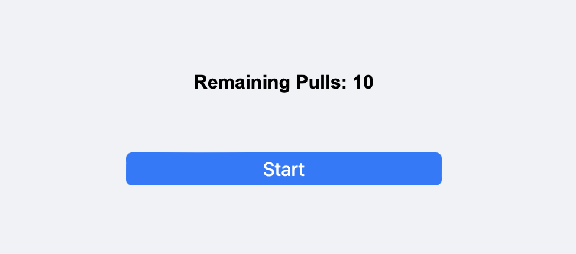

# Gacha Test V3

**Deployed web**: [https://gacha-test-v3.netlify.app](https://gacha-test-v3.netlify.app)

## Overview

Welcome to the Gacha Test V3 project, a Human-Computer Interaction (HCI) testing environment designed to simulate a gacha game system. This web application allows researchers to manipulate the probabilities associated with the gacha mechanics and collect subjective feedback from participants using a Likert 7-point scale. The primary objective of this platform is to analyze the perceived value and satisfaction derived from different reward structures typically found in gacha games.

### Key Features

- **Dynamic Gacha System**: Adjust probabilities and simulate different gacha pulling scenarios to understand player satisfaction and reaction.
- **Participant Interaction**: Users engage with the system by pulling gachas, receiving items of varying rarity, and providing feedback through an intuitive interface.
- **Real-time Results**: Collect and display feedback immediately through a dashboard, enabling quick analysis and iteration of experiment conditions.
- **Extensive Customizability**: Set up multiple cases with different configurations to test a range of hypotheses about user behavior and preferences.
- **Exportable Data**: Automatically generate and download comprehensive logs in CSV format, allowing for detailed data analysis.

This platform serves as a powerful tool for researchers and developers interested in the psychological impacts of reward systems in digital games and applications.

## HCI Test Website

This environment has been set up to adjust the probabilities in a "gacha" game mechanism and collect participant responses using a Likert 7-point scale.

## Terminology

1. **Pulling**: The process of drawing items in the gacha game. Participants perform ten pulls per case study.
2. **Item**: Objects received from each pull. Each item is assigned a rank.
3. **Rank**: Items are categorized into three ranks based on rarity: S (Super), R (Rare), and C (Common).

## Screenshots

### Rank Overview

- **S rank**: Super
- **R rank**: Rare
- **C rank**: Common

### Interface 1: Index

Participants can set their name and choose between a trial run and the main experiment. The trial run allows the selection from one of nine cases, while the main experiment randomly assigns one of the cases.

### Interface 2: Gacha Ready

Press the 'Start' button once ready.

### Interface 3: Gacha Pulling

Pressing the 'Pull' button decreases the remaining count by one and presents a new array of items.

### Interface 4: Evaluation

Evaluation screen. Participants rate the perceived number of S rank items using a Likert 7-point scale. Results can be viewed on the dashboard.

Screen displayed upon completing an evaluation session.

### Interface 5: Dashboard

After completing nine trials, results can be viewed on this screen and downloaded as a log file named `log_피험자명.csv`.

Log table example.
